# 基于用电可靠性的配电网规划模型——全国第二
我们团队的这份方案，从全社会 **1611 支队伍、3438 名参赛者**中脱颖而出，获得了**深圳杯数学建模挑战赛的全国第二**！

> “深圳杯”数学建模挑战赛（原名为：全国大学生数学建模夏令营）是全国大学生数学建模竞赛活动的延伸，由全国大学生数学建模竞赛组委会组织。放宽了对参赛者地域和身份的限制，大学生、研究生以及社会人士都可以参赛，解答时间也比较长，而且允许参赛同学自由地和老师、甚至专家一起研讨。本次大赛历经4个月的全国初赛海选，最后选出66支决赛队伍进行角逐。

## 背景知识
随着城市化进程加速，深圳等超大城市对电力供应的可靠性和经济性提出更高要求。传统配电网多为单电源树状结构（单供），一旦电源或线路故障，下游用户面临全面停电风险。例如，医院、数据中心等关键用户停电可能造成巨额经济损失或公共安全事件。为应对此问题，需通过双电源互联（双供）提升系统冗余，但新增联络线、开关和电源扩容会大幅增加建设成本，需在可靠性提升与经济性之间权衡。

  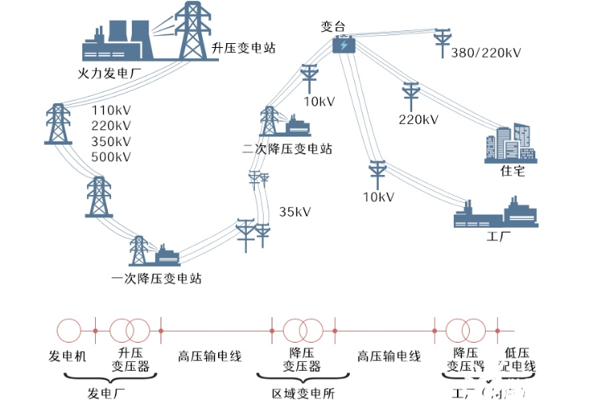

如何在有限预算（如题目中的建造费用上限）内，通过拓扑优化（联络线布局、开关配置）和电源扩容，实现用户最低可靠性最大化或全系统可靠性达标，是本项目需解决的工程-经济协同难题。

## 解决什么问题
我们解决的是配电网的规划问题。在已知电站和用户地理位置的条件下，合理规划电网来减少线路和开关的铺设费用并提高用户的用电可靠性。

我们的**最终目标**是建立一个低成本、高可靠性的双供配电网。为了实现这个最终目标，我们将问题拆分成以下四个子问题：

  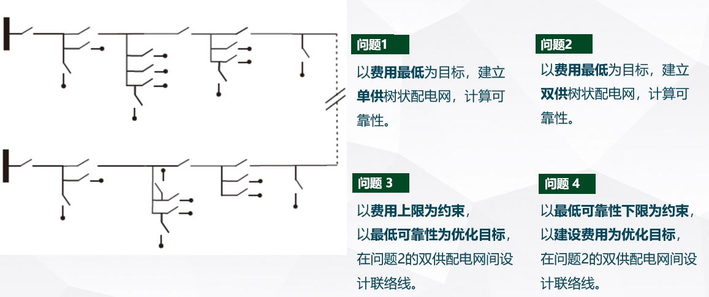

## 如何解决问题
这是非常复杂的问题，我们写了 122 页的论文来解决这个问题。这里仅列出主要思想与图片，以供大家预览。具体思路和解决方案参见 PDF。

### 问题一：单供配电网的建立
已知一个电源和一批用户的平面坐标、每个用户用电功率需求、每个设备单元建造费用。以费用最低为目标求单供树状配电网，给出树状配电网的分叉点坐标，并计算每个用户的用电可靠性。

  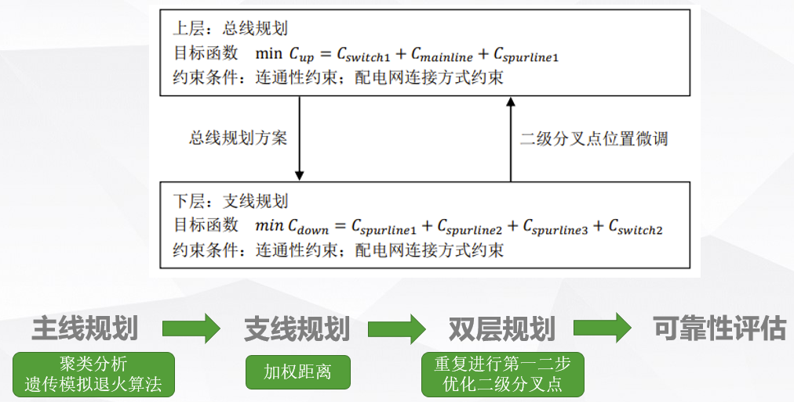

这是一个单电源配电网规划问题。配电网建造费用作为总规划目标；开关设置原则，开关价格与限流，单位线路造价，变电站与负荷的平面坐标为约束条件。为简化问题，我们将配电网规划拆解成两部分规划：主线规划和支线规划，建立双层规划模型。 

上层规划以主线为优化对象；基于负荷的坐标，我们通过聚类算法对负荷进行分类，以此确定分支数量，并将聚类中心作为初始二级分叉点。在此基础上，通过遗传-模拟退火算法得到主线的最佳规划，并得到一级分叉点位置。 下层规划以支线为优化对象，对每个簇进行二次嵌套聚类分析，运用加权距离和等效电源的思想建立模型，得到支线的最佳规划和二三级分叉点的位置。

上层规划和下层规划并不是严格独立的，上下层的结果会相互影响。我们通过不断迭代优化二级分叉点的位置，最终得到最佳的配电网规划和最小建设费用。 

最后我们建立用户可靠性评估模型，计算出每个故障单元的故障率，根据故障单元的独立性，最终算出每个用户的用电可靠性。 

  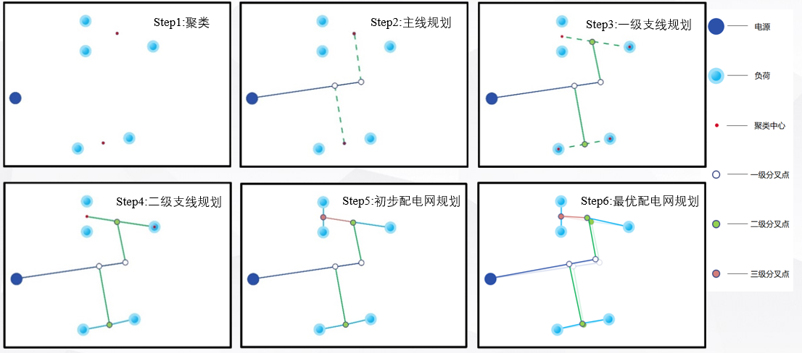

### 问题二：两个单供配电网的建立
问题二要求设计两个单供配电网，使得总建造费用最低。我们需要先解决负荷的供电归属问题，再延用问题一的思路和模型设计两个单供配电网。 

首先，我们要解决负荷的供电归属问题，即确定负荷点由电源1还是电源2供电。当聚类簇数为𝑘时，总共会出现 $2^k$ 种情况，排除由某一个电源为所有负荷供电的情况，仍有 $2^{k} - 2$ 种情况。若直接采用第一问的模型对所有情况进行遍历计算，计算量将十分巨大。由于最小生成树的边长总和一定程度上能反映负荷与电源的聚集程度，因此可以采取比较最小生成树长度总和的方法来简化计算量，选取出几种总长度较小的情况做后续的优化。

  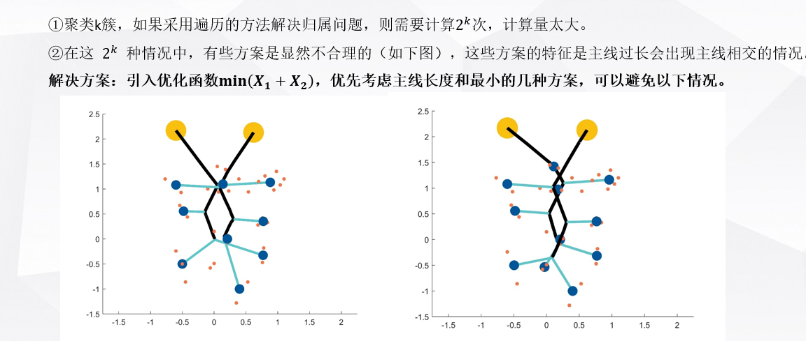

然后，我们分别对第一步筛选出几种负荷归属方案，使用问题一的双层规划模型，得到多种规划方案。我们将总造价最低的方案确定为最优方案。

  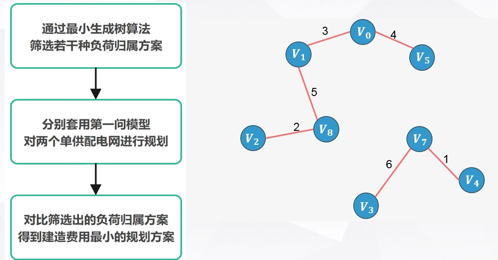

### 问题三：双供配电网的建立
在问题二两个单供配电网规划的基础上，新增若干条联络线和开关，形成双供配电网。我们以提高配电网中最低的用电可靠性为目标；以建造总费用上限为 X，双供配电网用户供电调度原则和主线限流条件为约束条件建立模型。

  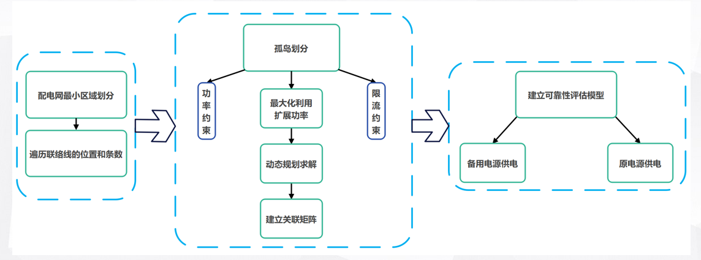

首先，我们需要确定联络线的个数。由于总花费上限没有给出具体数据，因此我们对一条联络线，两条联络线，三条联络线的情况分别进行优化并得出建造总费用。

其次，我们需要确定联络线的位置。我们通过配电网的最小区域划分，对联络线的连接位置进行遍历。

对每种联络线设计方案，我们针对不同的故障情况进行动态孤岛划分。为了满足双供配电网用户供电调度原则，依据划分的最小配电区域，我们通过关联矩阵表征不同故障发生时负荷点的供电情况，采用动态规划的算法，实现孤岛划分。

  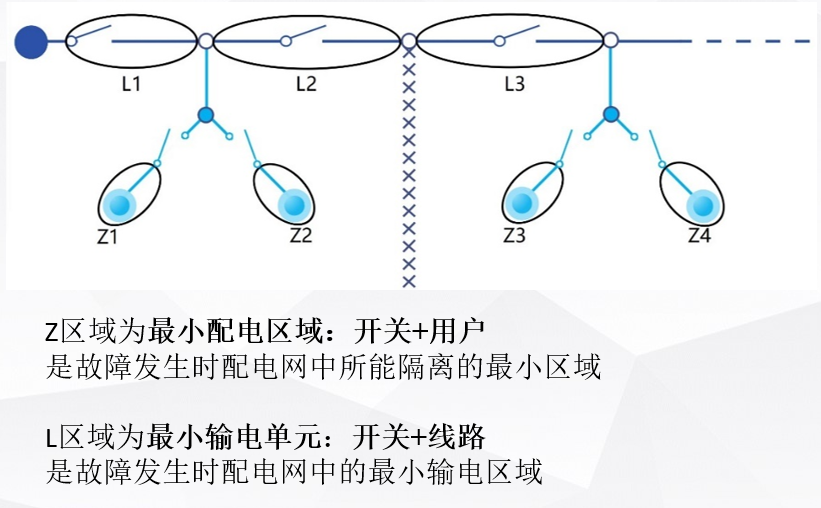

最后，我们建立双供配电网可靠性评估模型。针对双供配电网多种供电线路方案，对问题一，二中的用户可靠性模型进行改进，得到双供配电网的可靠性评估模型，计算出每种联络线规划的最低的用户可靠性，选择最低用户可靠性最大的方案作为最佳方案。

### 问题四：双供配电网的优化
问题四和问题三同理，改变了问题三的约束条件与优化目标。以降低建设费用为优化目标；以每个用户的用户可靠性不低于Y%，双供配电网用户供电调度原则和主线总限流为约束条件。

  

首先，我们需要确定联络线的个数。同样由于最低的用户可靠性数据未定，因此我们只讨论连接一条联络线和两条联络线的情况并分别得出建造总费用。 

其次，在确定了联络线的数量后，我们仍按照问题三的思路对联络线的连接位置进行遍历，用关联矩阵去表征不同故障发生时的负荷点供电情况。 

最后，我们通过双供配电网用户用电可靠性评估模型，计算出每种联络线规划方案的最低建造费用，选择建造费用最低的方案作为最佳方案。

## 得到了什么结果
我们团队的这份方案，从全社会 **1611 支队伍、3438 名参赛者**中脱颖而出，获得了**深圳杯数学建模挑战赛的全国第二**！

### 问题一：单供配电网的建立
我们融合了遗传算法和模拟退火算法，对电网主干进行优化。优化过程如下：

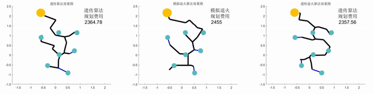

遗传算法，模拟退火算法，我们融合的遗传退火算法，特点分别如下

  

整个优化过程如下：

  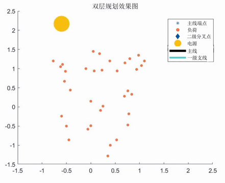

### 问题二：两个单供配电网的建立

  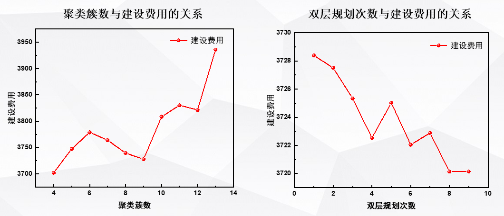

  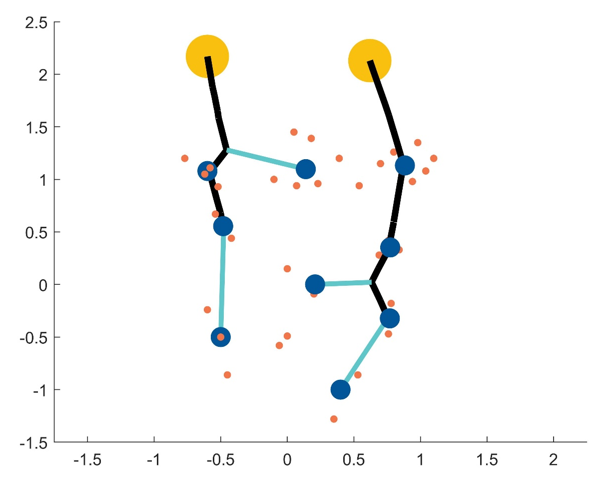

### 问题三：双供配电网的建立

  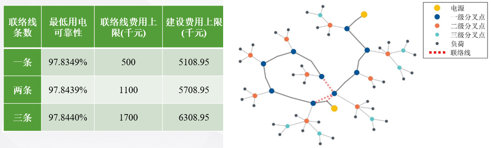

  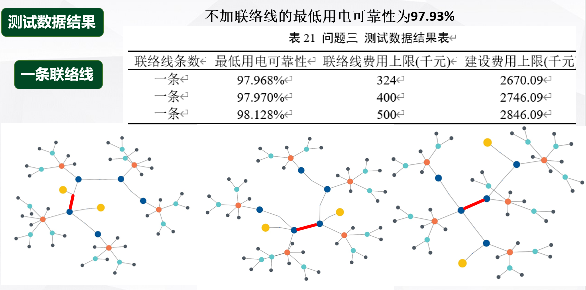

### 问题四：双供配电网的优化

  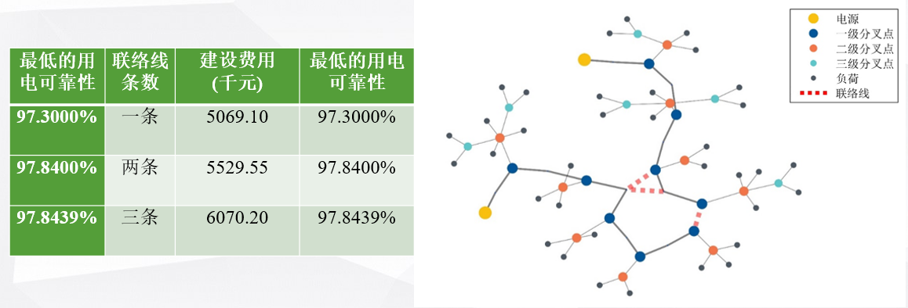

  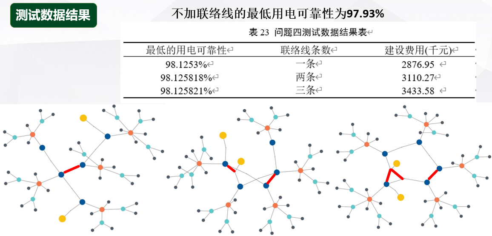

## 文件说明

* B题-深圳杯2022.pdf：题目详细介绍
* 基于用电可靠性的配电网规划模型.pdf：我们的最终论文，122 页
* 答辩ppt.pptx：需要向专家委员组答辩，从而角逐全国奖项，这是我们的答辩ppt
* 支撑材料：代码和数据全部在里面了，应该写了蛮多注释的

## 参考文献
[1]孙若萱. 计及分布式电源的高可靠性配电网规划方法研究[D].东南大学,2019. 

[2] 査伟雄,孙敬. 基于模拟退火算法的危险货物道路运输路径优化双层规划模型[J]. 公路交通科技,2012,29(04):101-106. 

[3]解晨,韦雄奕.模拟退火算法和遗传算法的比较与思考[J].电脑知识与技
术,2013,9(19):4418-4419.
